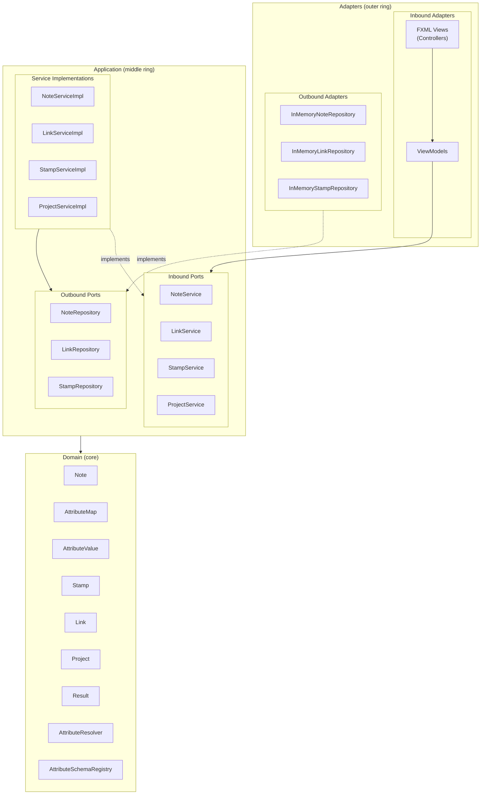
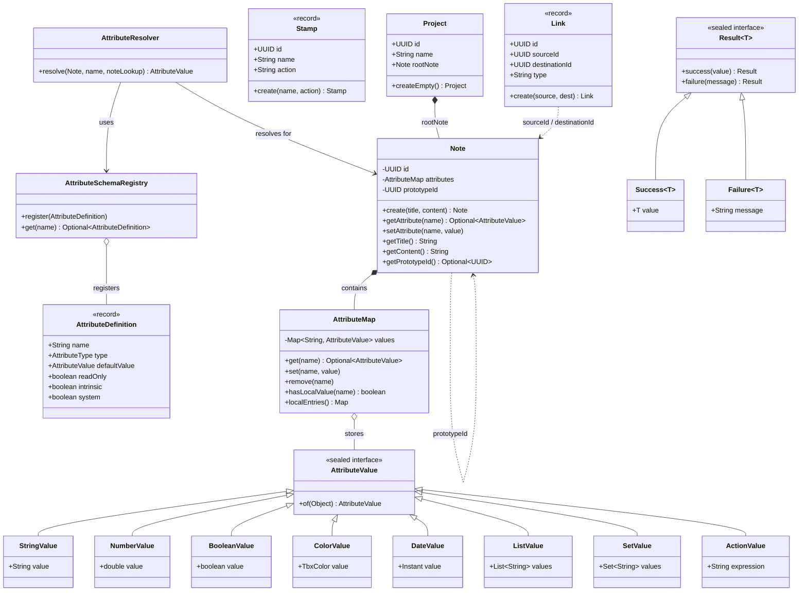
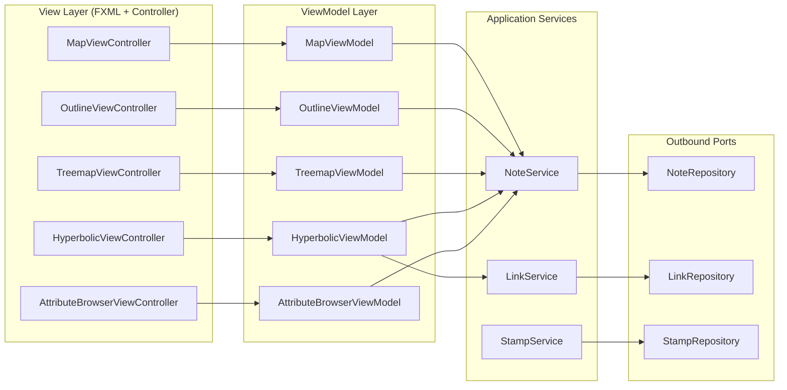
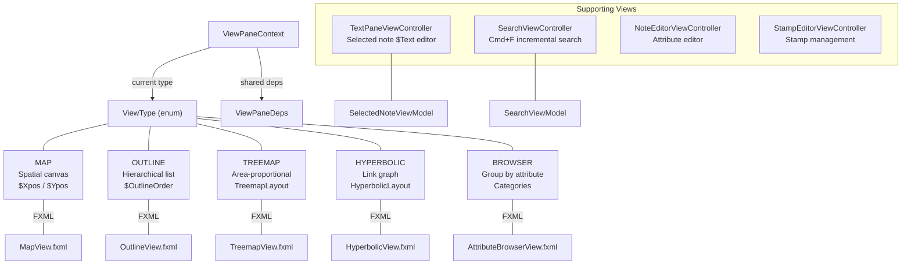
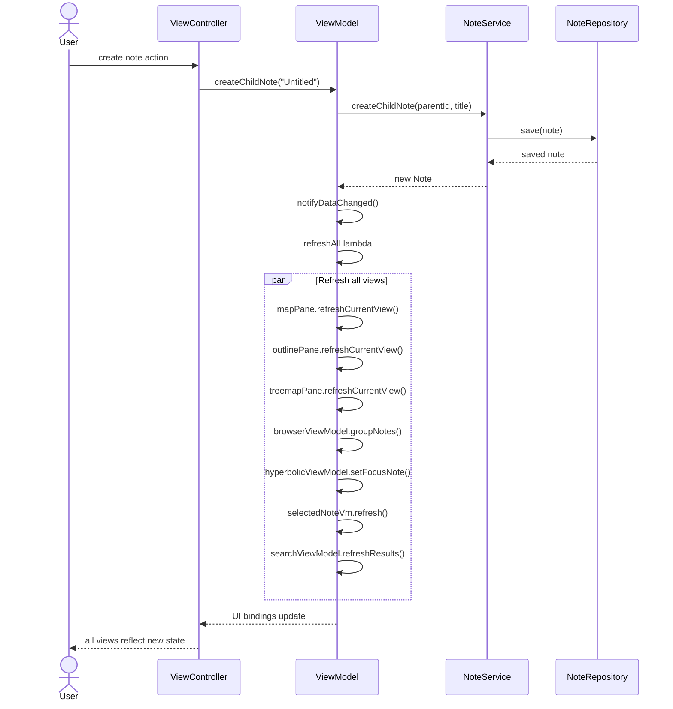
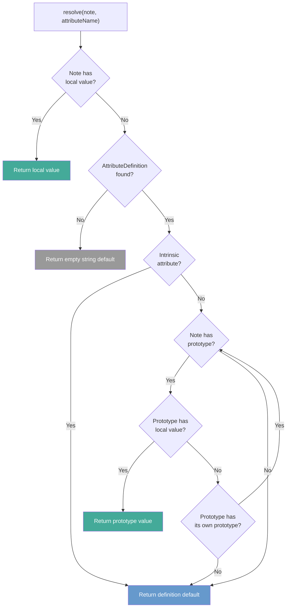
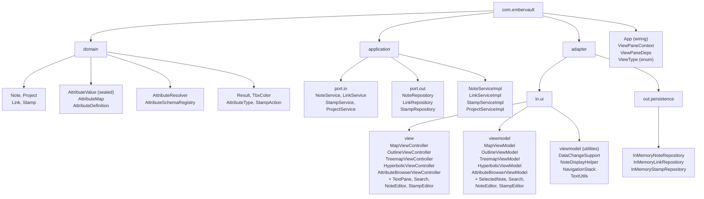

# EmberVault Architecture

EmberVault is a Tinderbox-inspired note-taking application built with JavaFX, following hexagonal architecture (ports and adapters) with MVVM for the UI layer.

## System Overview

## Domain Model

## MVVM Architecture

Each view follows the Model-View-ViewModel pattern. Views are FXML controllers that delegate all logic to ViewModels, which interact with application services through inbound ports.

## View Types and Switching

Five view types are available. Each view pane can switch between types via a right-click context menu on its tab title label. `ViewPaneContext` manages the lifecycle of each pane.

## Data Flow

When a note is created or modified, all views refresh from the single authoritative repository. No view caches `Note` objects across refreshes.

## Attribute Inheritance

`AttributeResolver` resolves attribute values through a prototype chain. Intrinsic attributes skip the chain and go directly to the document default.

Example chain: a note's `$Color` is resolved as Note local value, then Prototype's value, then Prototype's Prototype's value, then the `AttributeDefinition` default.

## Package Structure

Dependency flow is strictly inward: `adapter` depends on `application` ports, `application` depends on `domain`. ArchUnit tests enforce these boundaries at build time.
